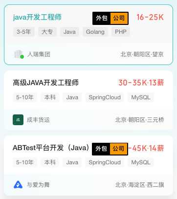
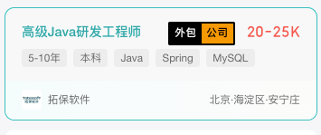
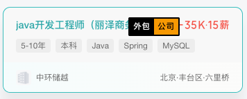

# BOSS直聘外包公司标记插件

一个简单但实用的 Chrome 扩展插件，帮助求职者在 BOSS 直聘上快速识别外包公司。

## 功能特点

- 自动识别并标记外包公司
- 实时监测页面变化，支持动态加载的职位信息
- 醒目的 Pornhub 风格标记，让外包公司一目了然
- 支持滚动加载新内容时的自动标记
- 完全开源的外包公司数据库，支持社区共同维护

## 安装方法

1. 下载本项目的 ZIP 包或克隆仓库到本地
2. 打开 Chrome 浏览器，进入扩展程序页面 (chrome://extensions/)
3. 开启右上角的"开发者模式"
4. 点击"加载已解压的扩展程序"，选择项目文件夹

## 使用方法

1. 安装插件后访问 [BOSS直聘](https://www.zhipin.com/)
2. 在"推荐"Tab浏览职位列表时，外包公司会自动被标记出来
3. 标记会在职位名称旁边显示，不会遮挡重要信息

## 贡献指南

欢迎提交 PR 来完善外包公司数据库！

1. Fork 本项目
2. 修改 `companies.txt`，添加新的外包公司
3. 提交 Pull Request

修改外包公司列表时请注意：
- 每行一个公司名称
- 删除重复的公司名称
- 确保添加的确实是外包公司

## 隐私说明

- 本插件完全在本地运行，不会收集任何用户数据
- 公司列表存储在本地，不会向外部发送任何请求
- 源代码完全开放，欢迎检查和审计

## 技术实现

- 纯原生 JavaScript 实现，无需任何框架
- 使用 MutationObserver 监听页面变化
- 使用事件防抖优化性能

## 开源协议

MIT License

## 免责声明

本插件仅供参考，公司性质请以实际情况为准。使用本插件产生的任何后果由使用者自行承担。

## 联系方式

如有问题或建议，欢迎提交 Issue 或 Pull Request。

## Star History

