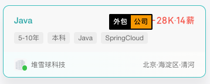

# BOSS Zhipin Outsourcing Company Marker

A simple yet practical Chrome extension that helps job seekers quickly identify outsourcing companies on BOSS Zhipin.

[中文文档](./README.md)

## Features

- Automatically identifies and marks outsourcing companies
- Real-time page monitoring, supports dynamically loaded job listings
- Eye-catching Pornhub-style markers for easy identification
- Automatic marking support for newly loaded content while scrolling
- Fully open-source company database with community maintenance support

## Installation

1. Download the ZIP package or clone the repository locally
2. Open Chrome browser and navigate to extensions page (chrome://extensions/)
3. Enable "Developer mode" in the top right corner
4. Click "Load unpacked" and select the project folder

## Usage

1. After installation, visit [BOSS Zhipin](https://www.zhipin.com/)
2. Browse job listings in the "Recommended" tab, outsourcing companies will be automatically marked
3. Markers appear next to job titles without obscuring important information

## Contributing

PRs are welcome to improve the outsourcing company database!

1. Fork this project
2. Modify `companies.txt` to add new outsourcing companies
3. Submit a Pull Request

When modifying the company list, please note:
- One company name per line
- Remove duplicate company names
- Ensure added companies are actually outsourcing companies

## Privacy Statement

- This extension runs completely locally and doesn't collect any user data
- Company list is stored locally and no external requests are made
- Source code is fully open for inspection and audit

## Technical Implementation

- Pure JavaScript implementation, no frameworks required
- Uses MutationObserver to monitor page changes
- Implements event debouncing for performance optimization

## License

MIT License

## Disclaimer

This extension is for reference only. Please verify company nature independently. Users assume all responsibility for consequences of using this extension.

## Contact

For issues or suggestions, please submit an Issue or Pull Request.

## Star History

 